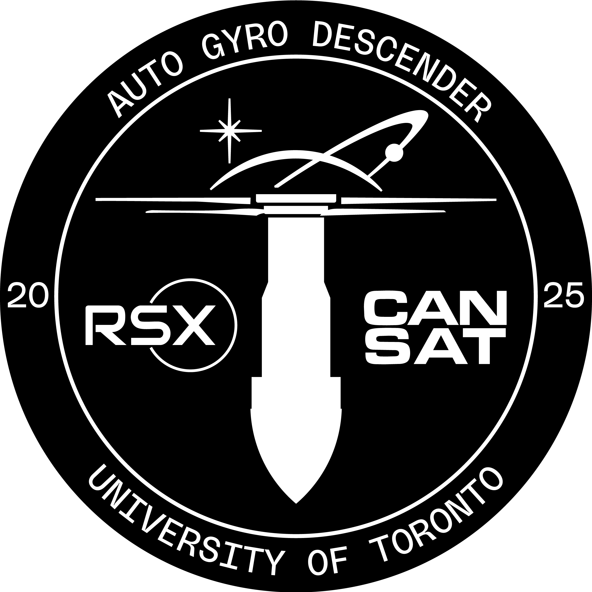
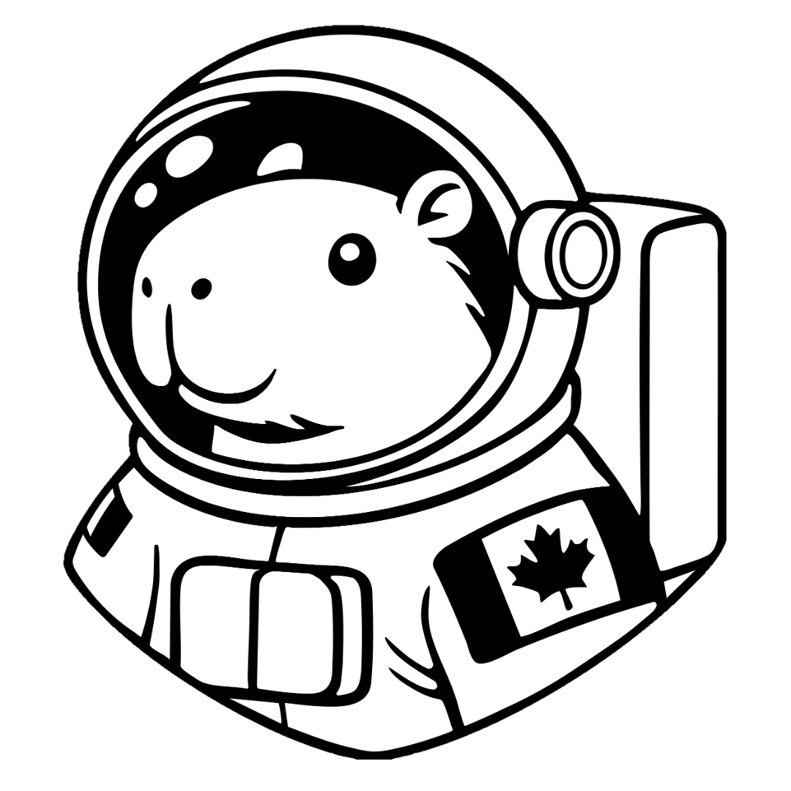

# RSX CanSat 2T5-2T6 Designs 

  
  
  

 

This repository is designed to manage the files made by the CanSat Team under the Robotics for Space eXploration (RSX) design team at the University of Toronto. 

**Competition Team Members:**
- Adam Kabbara | CanSat Team Lead
- Arthur Goetzke-Coburn | Mechanical Team Lead
- Daniel Yu | Electrical Team Lead
- Luke Watson | Software Team Lead
- Gianluca Ceccacci | Mechanical Team Member
- Nour Barsoum | Electrical Team Member
- Angelique Liao | Software Team Member
- Alexey Albert | Mechanical Team Member
- Robert Saab | Electrical Team Member

**CanSat Competition:**
- 📅 June 4-7, 2026
- 📍 Monterey, Virginia, United States
- 📃 [Mission document](CanSat_Mission_Guide_2026a.pdf)
